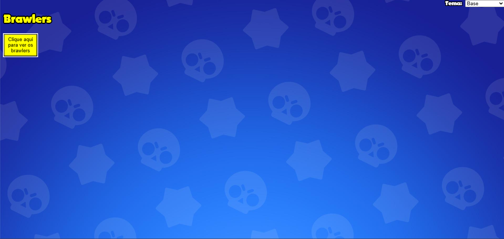
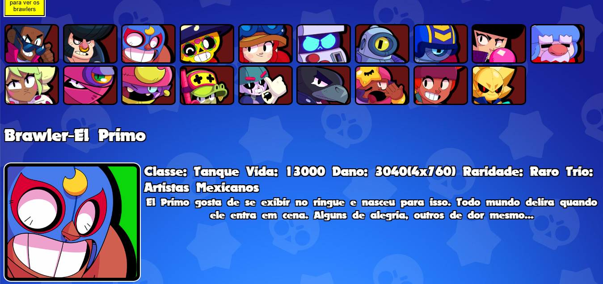
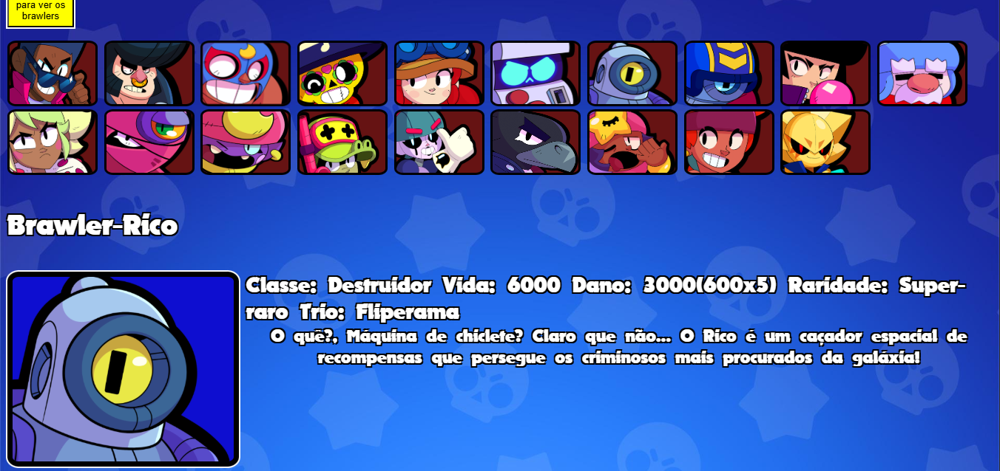
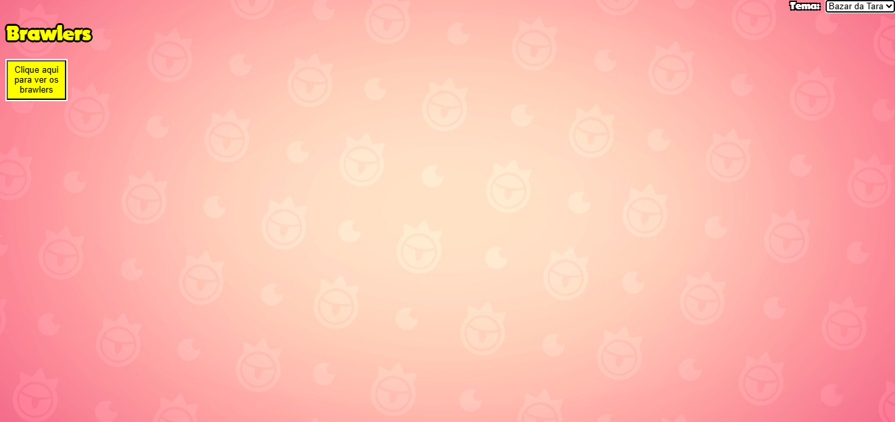
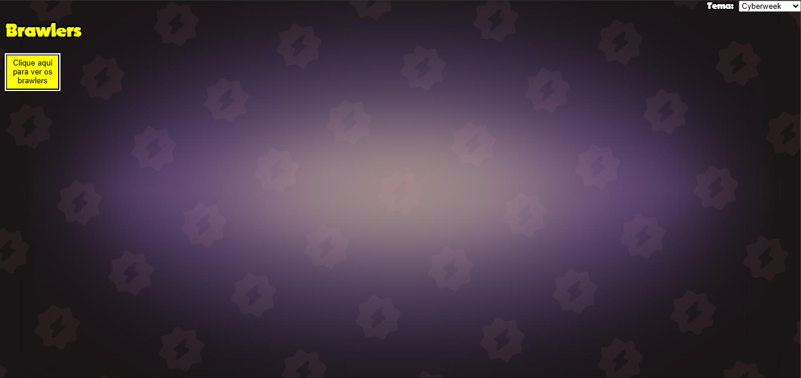
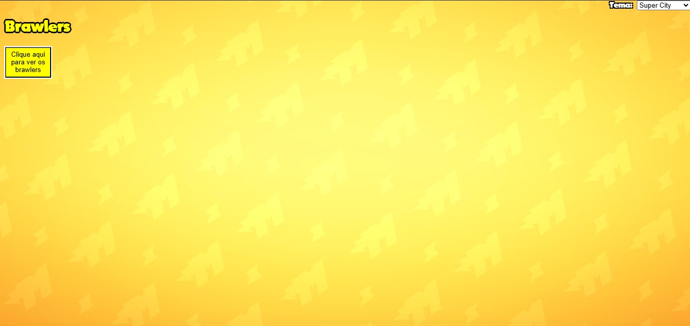

# BrawlWeb

Aplicação Web Full Stack desenvolvida com Flask, JavaScript e MySQL para consulta dinâmica de informações dos personagens de Brawl Stars.

## 📖 Sobre o projeto

O **BrawlWeb** é um projeto de desenvolvimento web criado com o objetivo de apresentar informações dos personagens do jogo **Brawl Stars** de forma dinâmica.

As informações exibidas não são fixas no HTML. Os dados são consultados em um banco de dados MySQL através de uma API desenvolvida em Flask e enviados ao frontend utilizando JavaScript e Fetch API.

Este projeto foi desenvolvido principalmente para consolidar conhecimentos em desenvolvimento Full Stack e integração entre frontend, backend e banco de dados.

---

## 📸 Demonstração

### Tela Inicial:

    

### Brawlers

    
    

### Temas

    
    
    

---

## ✨ Funcionalidades

- Consulta dinâmica de informações dos brawlers
- Exibição de:
  - Nome
  - Classe
  - Raridade
  - Trio
  - Vida
  - Dano
  - Descrição
- Alteração dinâmica das informações ao selecionar um personagem sem recarregar a página
- Alteração automática do estilo visual conforme a raridade do personagem
- Troca de temas do site
- Comunicação em tempo real entre Frontend, Backend e Banco de Dados

---

## 🛠️ Tecnologias utilizadas

### Frontend

- HTML5
- CSS3
- JavaScript

### Backend

- Python
- Flask
- Jinja2

### Banco de Dados

- MySQL

---

## 🎯 Competências desenvolvidas

Durante o desenvolvimento deste projeto foram aplicados e aprofundados conhecimentos como:

- Desenvolvimento Full Stack
- Estruturação de projetos utilizando Flask
- Organização entre Frontend e Backend
- Consumo de APIs utilizando Fetch API
- Comunicação entre processos através de requisições HTTP
- Integração com banco de dados MySQL
- Modelagem e consultas SQL
- Manipulação dinâmica do DOM
- Serialização de dados utilizando JSON
- Arquitetura Cliente-Servidor
- Organização de código utilizando Blueprints
- Estruturação de diretórios para aplicações web
- Boas práticas de separação de responsabilidades (Frontend, Backend e Banco de Dados)

---

## 🚀 Objetivos do projeto

Este projeto foi desenvolvido com foco em aprendizado e prática de conceitos relacionados ao desenvolvimento web, permitindo colocar em prática conhecimentos que vão além da construção da interface, incluindo comunicação entre aplicações, integração com banco de dados e organização de um projeto Full Stack.

---

## ⚠️ Aviso

Este projeto foi desenvolvido exclusivamente para fins educacionais e de demonstração de conhecimentos em desenvolvimento de software.

As imagens, personagens, nomes, logotipos e demais elementos relacionados a **Brawl Stars** pertencem à **Supercell Oy**.

Este projeto não possui qualquer vínculo oficial com a Supercell e não possui finalidade comercial.